<h1>File and Directory Managment</h1>

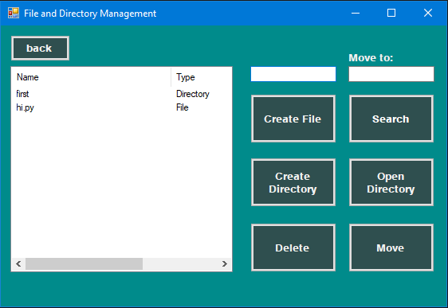
 <h3>A file system management application that allows you to create, move, delete, and search files and directories.</h3>
 <h2>How it's works:</h2>

 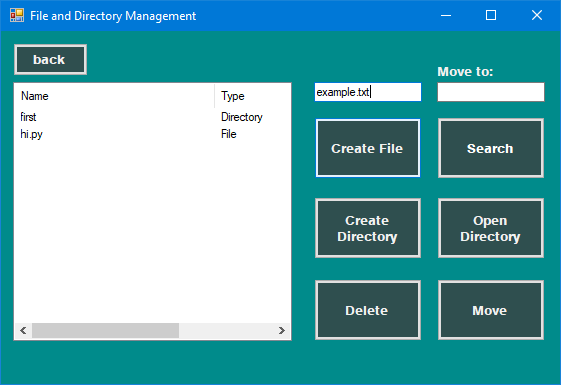

 You can create a file by clicking "Create File" button

 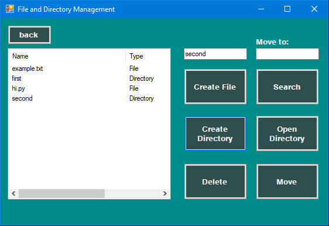

 And also you can create directory by clicking "Create directory" button
 
 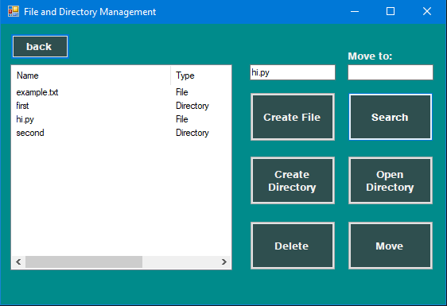

 By clicking "Search" button you will find file or directory that you need
 
 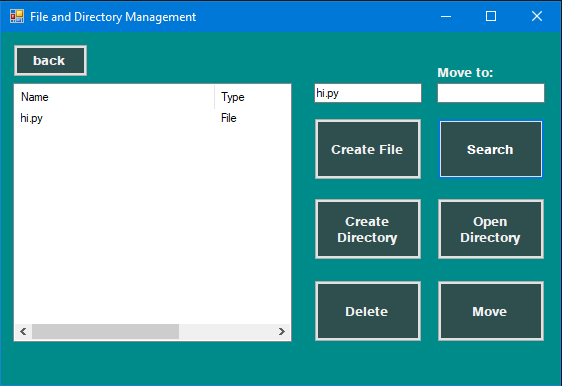

 To come back to list of files press "Back"
 button

 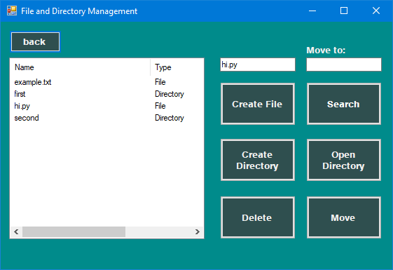
 
 It will return you back

 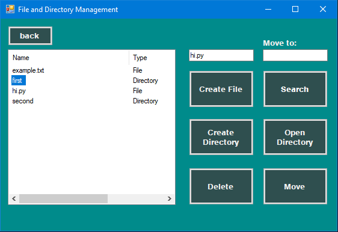

 If you want to delete anything just click on it and press button "Delete"
 
 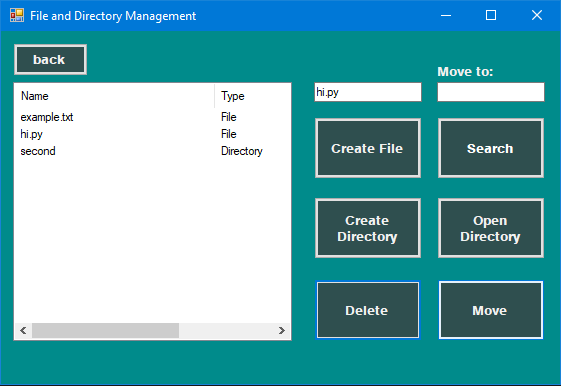

 Result

 

 To move your file somewhere else write name of the directory in "Move to" and choose file that you want to move

 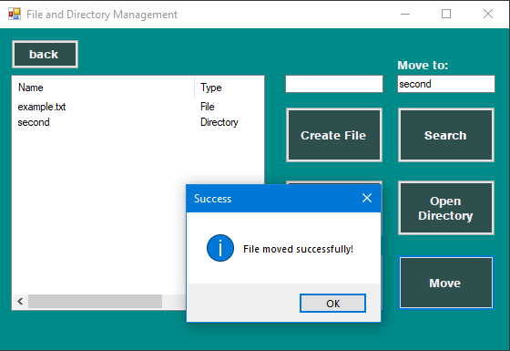

 Success

 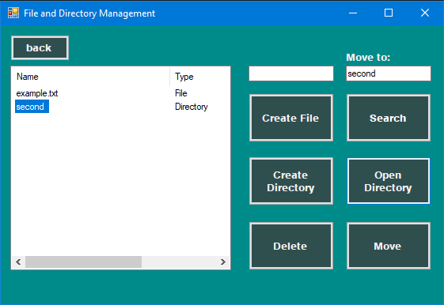

 After if you need to check it click on directory and press button "Open Directory"

 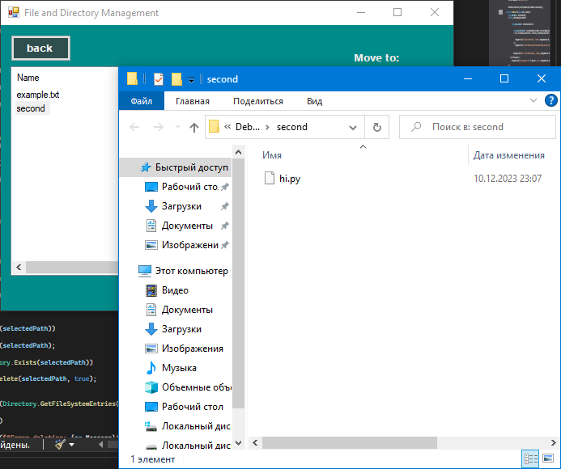

 Thank you for reading instruction
